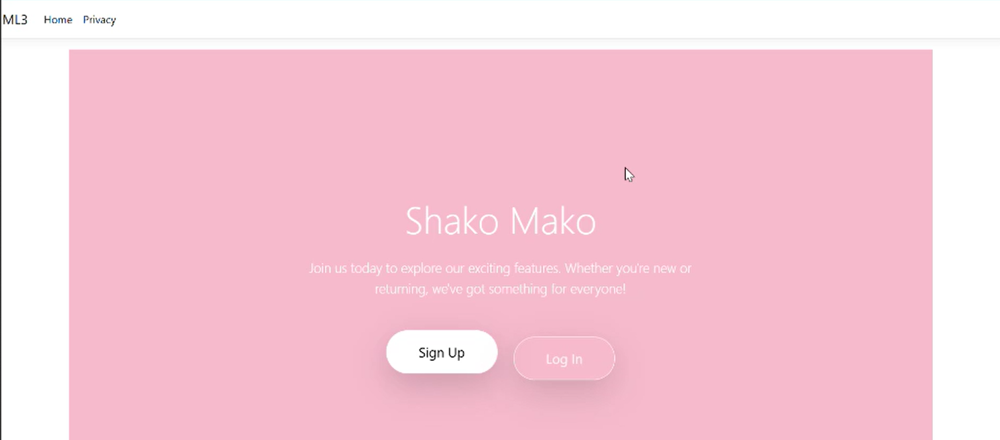

# 🎓 ShakoMako – Gamified Personalizable Educational Platform

> *An ASP.NET Core + SQL Server web app designed for engaging, adaptive learning.*

ShakoMako delivers **personalized education** that adapts to learners’ unique needs while boosting motivation through **gamification**—including rewards, quests, achievements, and leaderboards.  

---

## 🚀 Features

✅ **Personalized Learning Profiles**  
- Preferences, personality traits, emotional state  
- Accessibility and health considerations

✅ **Adaptive Learning Paths**  
- Dynamic, evolving sequences tailored to each learner  

✅ **Courses & Modular Content**  
- Multi-format modules (videos, quizzes, text)  
- Difficulty levels and learning objectives

✅ **Interactive Quizzes & Assessments**  
- Structured tasks with grading criteria  
- Progress tracking

✅ **Gamification Elements**  
- 🏅 Badges
- 🎖️ Achievements
- 🗺️ Quests & rewards
- 🏆 Leaderboards

✅ **Instructor Management Tools**  
- Course creation and management  
- Learner progress review  
- Emotional feedback integration

✅ **Notifications**  
- Alerts about deadlines, new content, and opportunities

✅ **Discussion Forums** *(Planned)*  
- Peer-to-peer learning and collaboration

---

## 🏗️ Tech Stack

| Layer       | Technology                           |
| ----------- | ------------------------------------ |
| **Frontend** | ASP.NET Core Razor Pages            |
| **Backend**  | ASP.NET Core Web API                |
| **Database** | SQL Server (Entity Framework Core)  |

---

## 📚 Database Overview

Our relational database schema is designed to manage all key aspects of the platform:

- Learners & Personalization Profiles
- Courses & Modules
- Learning Activities
- Enrollments
- Assessments
- Achievements & Badges
- Leaderboards
- Quests & Rewards
- Emotional Feedback & Interaction Logs
- Notifications & Discussion Forums

> *Above: Our ERD showing the core entities and their relationships.*

---

## 🎥 Demo Video

✨ **Experience the platform in action!**  

Click below to watch our full demo on YouTube:

---
